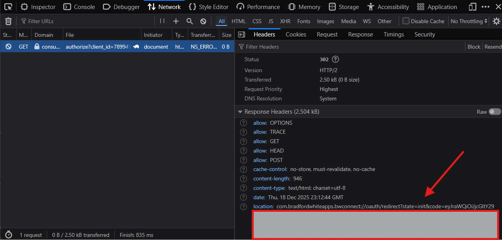

# Bradford White Wave Home Assistant Integration

This integration provides support for [Bradford White Water Heaters](https://www.bradfordwhite.com/) that use the "Wave" platform (e.g. Aerotherm G2).

Older models use the "Connect" platform and are supported by the [bradford-white-connect](https://github.com/ablyler/home-assistant-bradford-white-connect) integration, which this integration is based on.

## Features

- Control Operation Mode (Hybrid, Heat Pump, Electric, Vacation)
- Control Setpoint Temperature
- Sensor for current Operation Mode
- Energy Usage Sensors (Total, Heat Pump, Element) broken down by:
    - Daily
    - Weekly
    - Monthly
    - Yearly
- Config Flow for easy setup

## Installation

### HACS (Recommended)

1. Open HACS in Home Assistant.
2. Go to "Integrations".
3. Click the three dots in the top right and select "Custom repositories".
4. Add the URL of this repository.
5. Select "Integration" as the category.
6. Click "Add".
7. Find "Bradford White Wave" in the list and click "Download".
8. Restart Home Assistant.

### Manual

1. Copy the `custom_components/bradford_white_wave` directory to your `config/custom_components` directory.
2. Restart Home Assistant.

## Configuration

1. Go to Settings -> Devices & Services.
2. Click "+ ADD INTEGRATION".
3. Search for "Bradford White Wave".
4. Follow the configuration steps.

### Authentication

The authentication process requires a few manual steps because the relevant Redirect URI is a custom scheme (`com.bradfordwhiteapps.bwconnect://`) which cannot be automatically captured by Home Assistant easily.

1. The Config Flow will give you a link to the Bradford White login page. Click it.
2. Log in with your credentials.
3. You will eventually be redirected and hit a page that fails to load (because your browser doesn't know how to handle the `com.bradfordwhiteapps.bwconnect://` scheme).
4. Open your browser's Developer Tools (F12) and go to the "Network" tab.
5. Refresh the page if necessary to see the requests.
6. Look for the request that failed or has the `com.bradfordwhiteapps.bwconnect://` scheme. You need the **full URL** from the `Location` header or the request URL itself.

   

7. Copy that full URL (starting with `com.bradfordwhiteapps.bwconnect://...`) and paste it back into the Home Assistant dialog.

## Entities

### Water Heater

- `water_heater.device_name`: Controls for mode and temperature.
    - **Note**: The API does *not* report the current tank temperature, so the entity will not show a current temperature value.

### Sensors

- `sensor.device_name_energy_daily_total`: Daily total energy (kWh)
- `sensor.device_name_energy_daily_heat_pump`: Daily heat pump energy (kWh)
- `sensor.device_name_energy_daily_element`: Daily element energy (kWh)
- (Similar sensors for Weekly, Monthly, Yearly)

## Disclaimer

This is an unofficial integration and is not affiliated with Bradford White.
